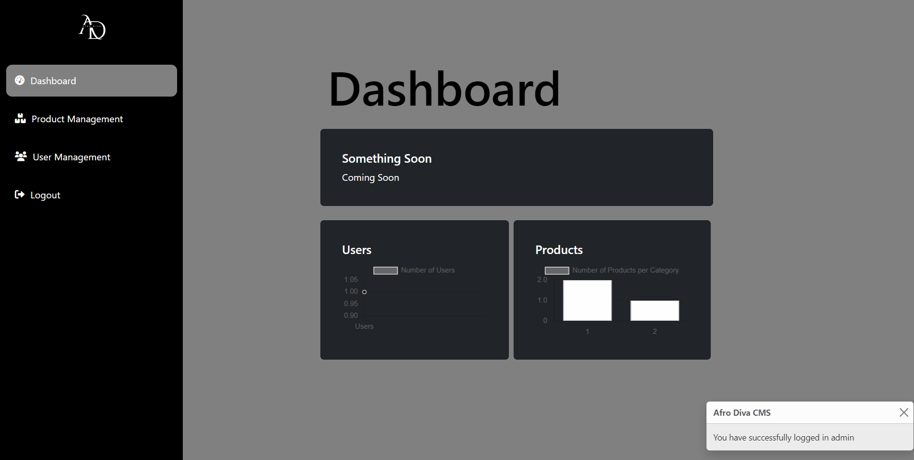
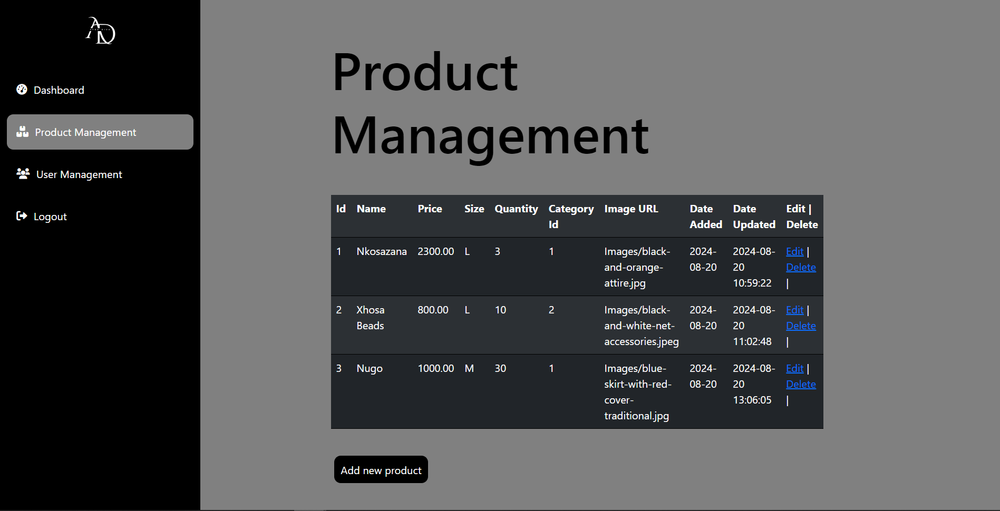

# AfroDiva CMS

This CMS helps streamline inventory management for a clothing business, offering an intuitive way to track stock, update product details, and organize items efficiently. Designed for ease of use, it ensures accurate inventory records and smooth daily operations.

✨ Features:
✅ Add, edit, and remove clothing items
📊 Track stock levels and availability
📂 Categorize products for better organization
📈 User-friendly dashboard for quick insights

Perfect for small businesses looking for a simple yet powerful inventory management solution! 🚀

[ Since I cant give you the login details I'd suggest you clone and edit the code to your liking ]

# Process
- Languages => php
- Framework => bootstrap
- Web Server Solution => XAMPP
- DMS => MySQL
- Hosting => MDB go

# Screenshot

