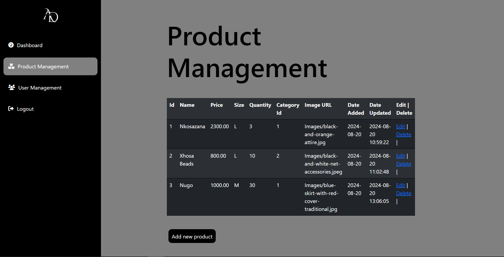

# afrodivacms

This is a CMS I made for my moms clothing business - Mostly for managing the clothing she has in her inventory.

[ Since I cant give you the login details I'd suggest you clone and edit the code to your liking ]

# Process
- Languages => php
- Framework => bootstrap
- Web Server Solution => XAMPP
- DMS => MySQL
- Hosting => MDB go

# Screenshot

